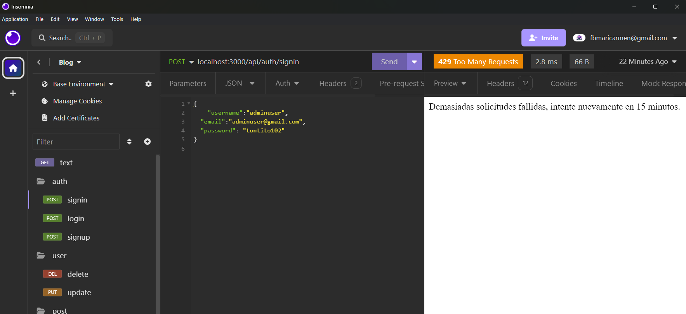

## 🚨 Implementación de Prácticas de Desarrollo Seguro
- 🔹ReCaptcha de Google para el formulario.

- 🔹Dentro de contacto se implementar 2 campos ocultos en el formulario contacto.

- 🔹y si todo va bien se envia a gmail.

- 🔹Rutas para login(email , password) con 2 roles diferentes admin y user.

usuario 
nadie2
nadie2@gamil.com
contraseña:
789456
- 🔹El admin es el único para crear, editar y eliminar usuarios.

- 🔹Panel de control, publicaciones, usuarios, comentarios y likes.

- 🔹Se aplica un middleware en la ruta limitando el número de peticiones aceptadas con tokenExpirationTime.

